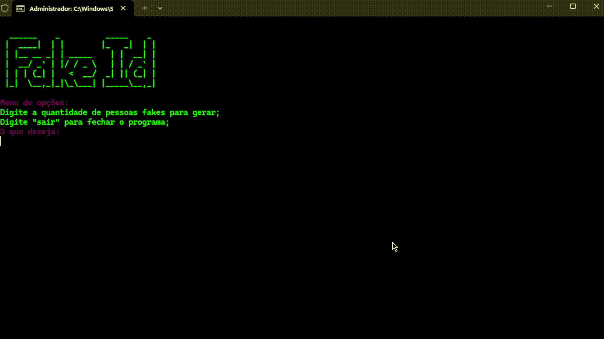

# Gerador de Identidades Falsas 🇧🇷

Um programa simples em Python que utiliza as bibliotecas **Faker** e **Colorama** para gerar dados fictícios de pessoas, como nome, CPF, e-mail, endereço e número de celular, com suporte para a localidade brasileira.

## 📋 Funcionalidades
- Geração de múltiplos perfis falsos.
- Dados incluem: Nome, CPF, E-mail, Endereço e Número de celular.
- Interface simples no terminal.
- Opção para encerrar o programa digitando `sair`.

## 🚀 Tecnologias Utilizadas
- **Python 3.x**
- **Faker** (para gerar dados fictícios)
- **Colorama** (para estilização do terminal)

## ▶️ Como Executar

1. Clone este repositório:
   ```bash
   git clone https://github.com/CauanNeves/fake-br-people.git
   ```

2. Acesse a pasta do projeto:
   ```bash
   fake-br-people
   ```

3. Instale as dependências:
   ```bash
   pip install -r requirements.txt
   ```

4. Execute o programa:
   ```bash
   python main.py
   ```

## 🛠️ Dependências
Certifique-se de ter as bibliotecas instaladas:
- `faker`
- `colorama`

Você pode instalar manualmente com:
```bash
pip install faker colorama
```

## 📝 Uso
- Execute o programa.
- Digite o número de identidades falsas que deseja gerar.
- Digite `sair` para fechar o programa.

## 📷 Demonstração


## 🤝 Contribuições
Contribuições são bem-vindas! Sinta-se à vontade para abrir uma *issue* ou enviar um *pull request*.

---
**Desenvolvido com 💻 por [Cauan Neves](https://github.com/CauanNeves)**